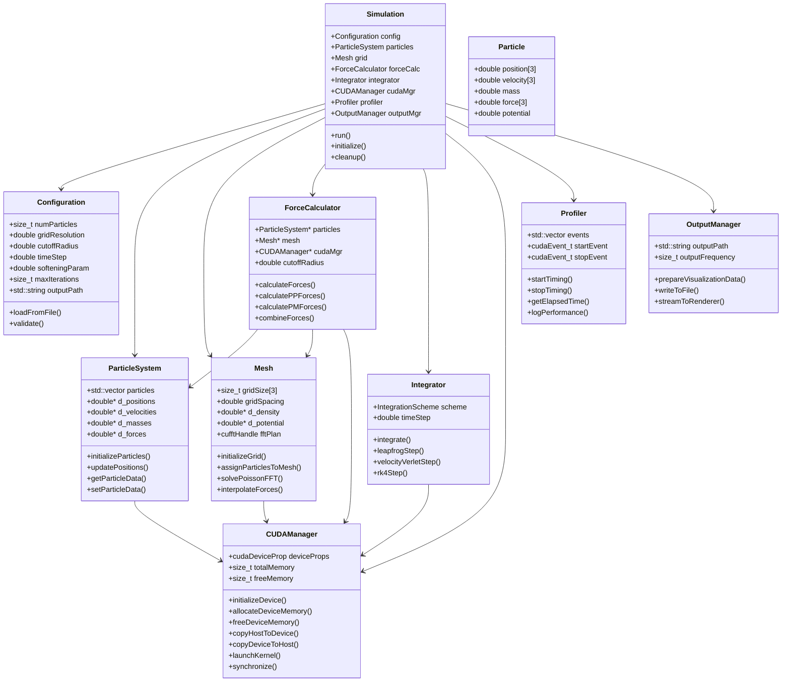
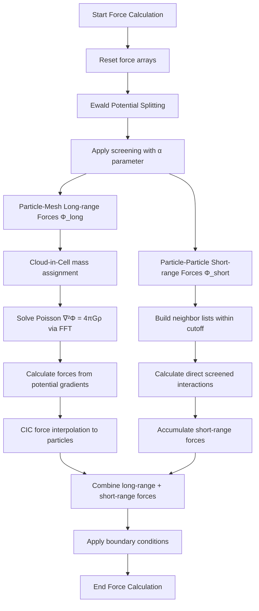
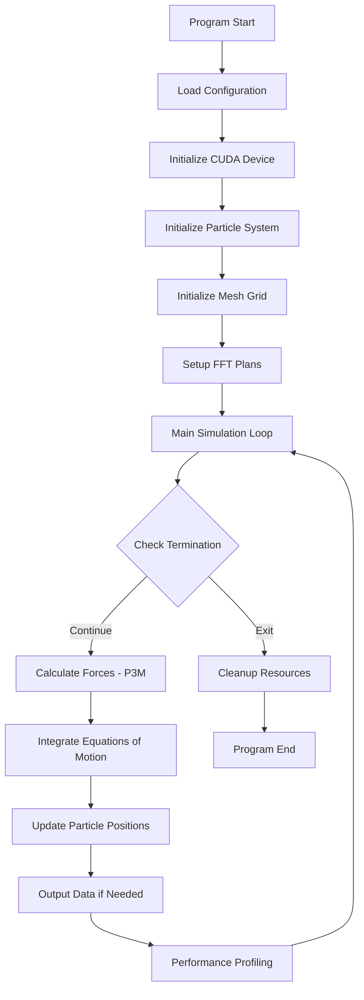

# N-Body Gravitational Simulation Architecture Design

## Overview
This document outlines the comprehensive class structure and program flow for a high-performance N-Body gravitational simulation using CUDA acceleration and the P3M (Particle-Particle/Particle-Mesh) technique.

## Core Requirements
- **N-Body Problem**: Gravitational interactions between N particles in 3D space
- **P3M Method**: Hybrid approach combining direct particle-particle calculations for short-range interactions and FFT-based particle-mesh calculations for long-range interactions
- **CUDA Acceleration**: GPU-optimized implementation with double-precision arithmetic
- **Scalability**: Support for large particle counts (10^6+ particles)
- **Modularity**: Clean separation of concerns with dedicated classes
- **Performance**: Optimized memory management, kernel launches, and data transfers

## Class Hierarchy and Relationships



## Data Structures

### Particle Data Layout
```cpp
struct Particle {
    double position[3];    // x, y, z coordinates
    double velocity[3];    // vx, vy, vz components
    double mass;           // particle mass
    double force[3];       // accumulated force components
    double potential;      // gravitational potential
};

// GPU memory layout (SoA - Structure of Arrays for better coalescing)
struct ParticleArrays {
    double* positions_x, *positions_y, *positions_z;
    double* velocities_x, *velocities_y, *velocities_z;
    double* masses;
    double* forces_x, *forces_y, *forces_z;
    double* potentials;
};
```

### Mesh Data Structure
```cpp
struct MeshGrid {
    size_t dimensions[3];      // grid size in each dimension
    double spacing;            // grid spacing (h)
    double origin[3];          // grid origin
    double* density;           // mass density field
    double* potential;         // gravitational potential
    cufftHandle forwardFFT;    // FFT plan for forward transform
    cufftHandle inverseFFT;    // FFT plan for inverse transform
};
```

## P3M Algorithm Implementation

### Ewald Splitting Technique
The P3M method uses **Ewald splitting** to decompose the gravitational potential into short-range and long-range components:

**Potential Splitting:**
```
Φ(r) = Φ_short(r) + Φ_long(r)
```

Where:
- **Φ_short(r)**: Screened short-range potential (computed via direct particle-particle)
- **Φ_long(r)**: Long-range potential (computed via mesh/FFT)
- **α (alpha)**: Ewald splitting parameter controlling the range separation

**Ewald Screening Function:**
```
Φ_short(r) = Φ(r) * erfc(α|r|)
Φ_long(r) = Φ(r) * erf(α|r|)
```

### Algorithm Overview
1. **Ewald Splitting**: Decompose potential using screening parameter α
2. **Particle Assignment**: Distribute particle masses to mesh using Cloud-in-Cell interpolation
3. **FFT-based Poisson Solver**: Solve ∇²Φ_long = 4πGρ using FFT in Fourier space
4. **Force Calculation**: Compute long-range forces from potential gradients
5. **Force Interpolation**: Interpolate long-range forces back to particles using CIC
6. **Short-range Correction**: Add direct particle-particle forces for Φ_short within cutoff radius

### P3M Force Calculation Flow



### Cloud-in-Cell (CIC) Interpolation

**Mass Assignment:**
For a particle at position **r**, the mass is distributed to the 8 nearest grid points using linear interpolation:

```
Mass contribution to grid point (i,j,k):
m_grid[i,j,k] += m_particle * W(x-i) * W(y-j) * W(z-k)
```

Where **W(x)** is the CIC weight function:
```
W(x) = max(0, 1 - |x|) for |x| < 1, 0 otherwise
```

**Force Interpolation:**
Forces are interpolated back to particle positions using the same CIC weights:
```
F_particle = Σ F_grid[i,j,k] * W(x-i) * W(y-j) * W(z-k)
```

## CUDA Kernel Design

### Memory Management Strategy
- **Host Memory**: Pinned memory for efficient transfers
- **Device Memory**: Optimized layouts for coalesced access
- **Data Transfers**: Minimize H2D/D2H transfers through batching
- **Kernel Launches**: Optimized block/grid dimensions for occupancy

### Key CUDA Kernels

```cpp
// Cloud-in-Cell mass assignment kernel
__global__ void assignParticlesCIC(
    const double* __restrict__ positions,
    const double* __restrict__ masses,
    double* __restrict__ density,
    const MeshParams meshParams,
    size_t numParticles
);

// Ewald potential splitting kernel
__global__ void applyEwaldSplitting(
    const double* __restrict__ positions,
    double* __restrict__ shortRangePotential,
    double* __restrict__ longRangePotential,
    double alpha,
    size_t numParticles
);

// Poisson solver (FFT-based) for long-range potential
__global__ void solvePoissonFFT(
    cufftDoubleComplex* __restrict__ densityFFT,
    cufftDoubleComplex* __restrict__ potentialFFT,
    const MeshParams meshParams
);

// Cloud-in-Cell force interpolation kernel
__global__ void interpolateForcesCIC(
    const double* __restrict__ positions,
    double* __restrict__ forces,
    const double* __restrict__ potential,
    const MeshParams meshParams,
    size_t numParticles
);

// Direct particle-particle kernel with Ewald screening
__global__ void calculatePPForcesEwald(
    const double* __restrict__ positions,
    const double* __restrict__ masses,
    double* __restrict__ forces,
    double alpha,
    double cutoffRadius,
    size_t numParticles
);

// Integration kernel
__global__ void integrateLeapfrog(
    double* __restrict__ positions,
    double* __restrict__ velocities,
    const double* __restrict__ forces,
    const double* __restrict__ masses,
    double timeStep,
    size_t numParticles
);
```

## Program Flow

### Main Simulation Loop



### Pseudocode for Main Simulation

```cpp
int main() {
    // Initialize configuration
    Configuration config;
    config.loadFromFile("simulation_config.json");

    // Create simulation components
    CUDAManager cudaMgr;
    cudaMgr.initializeDevice();

    ParticleSystem particles(config.numParticles);
    particles.initializeRandom(cudaMgr);

    Mesh grid(config.gridResolution, config.gridSpacing);
    grid.initialize(cudaMgr);

    ForceCalculator forceCalc(&particles, &grid, &cudaMgr, config.cutoffRadius);
    Integrator integrator(config.timeStep, IntegrationScheme::LEAPFROG);

    Profiler profiler;
    OutputManager outputMgr(config.outputPath, config.outputFrequency);

    // Main simulation loop
    for (size_t step = 0; step < config.maxIterations; ++step) {
        profiler.startTiming("force_calculation");

        // Calculate forces using P3M method
        forceCalc.calculateForces();

        profiler.stopTiming("force_calculation");

        profiler.startTiming("integration");

        // Integrate equations of motion
        integrator.integrate(particles, cudaMgr);

        profiler.stopTiming("integration");

        // Output data for visualization
        if (step % config.outputFrequency == 0) {
            outputMgr.prepareVisualizationData(particles, cudaMgr);
            outputMgr.streamToRenderer();
        }

        // Log performance metrics
        profiler.logPerformance(step);
    }

    // Cleanup
    cudaMgr.cleanup();
    return 0;
}
```

## Performance Optimizations

### Memory Optimizations
1. **Structure of Arrays (SoA)**: Better memory coalescing for GPU access
2. **Pinned Host Memory**: Faster host-device transfers
3. **Unified Memory**: Automatic memory management for large datasets
4. **Memory Pool**: Reuse allocated memory blocks

### Kernel Optimizations
1. **Occupancy Maximization**: Optimal block sizes and grid dimensions
2. **Shared Memory Usage**: Cache frequently accessed data
3. **Warp-level Primitives**: Use shuffle instructions for reductions
4. **Asynchronous Operations**: Overlap computation with data transfers

### Algorithm Optimizations
1. **Spatial Data Structures**: Use for efficient neighbor finding
2. **Load Balancing**: Distribute work evenly across GPU threads
3. **Precision Management**: Use single precision where acceptable
4. **Cache Blocking**: Optimize for GPU cache hierarchies

## Error Handling and Robustness

### Exception Hierarchy
```cpp
class SimulationException : public std::runtime_error {
    // Base exception for simulation errors
};

class CUDAException : public SimulationException {
    // CUDA-specific errors
};

class MemoryException : public SimulationException {
    // Memory allocation/deallocation errors
};

class ConfigurationException : public SimulationException {
    // Configuration file/parsing errors
};
```

### Error Recovery Strategies
1. **Graceful Degradation**: Fall back to CPU calculations if GPU fails
2. **Checkpoint/Restart**: Save simulation state for recovery
3. **Input Validation**: Comprehensive parameter checking
4. **Resource Cleanup**: Ensure proper cleanup on errors

## Configuration Management

### Configuration File Format (JSON)
```json
{
    "simulation": {
        "numParticles": 1000000,
        "maxIterations": 10000,
        "timeStep": 0.001,
        "softeningParameter": 0.01
    },
    "p3m": {
        "gridResolution": 128,
        "cutoffRadius": 2.5,
        "ewaldAlpha": 0.5,
        "interpolationScheme": "cic"
    },
    "cuda": {
        "deviceId": 0,
        "pinnedMemory": true,
        "unifiedMemory": false
    },
    "output": {
        "frequency": 100,
        "path": "./output/",
        "format": "binary"
    },
    "profiling": {
        "enabled": true,
        "logFile": "performance.log"
    }
}
```

## Scalability Considerations

### Large-Scale Optimizations
1. **Domain Decomposition**: Divide simulation domain across multiple GPUs
2. **Load Balancing**: Dynamic redistribution of particles
3. **Communication Optimization**: Minimize inter-GPU data transfers
4. **Memory Management**: Efficient handling of large datasets

### Performance Scaling
- **Strong Scaling**: Fixed problem size, increasing GPUs
- **Weak Scaling**: Problem size proportional to GPU count
- **Memory Scaling**: Optimize for different memory configurations

## Future Extensions

### Planned Features
1. **Multi-GPU Support**: Distributed computing across multiple GPUs
2. **Adaptive Mesh Refinement**: Variable resolution grids
3. **Advanced Integrators**: Higher-order symplectic integrators
4. **Visualization Integration**: Real-time OpenGL rendering
5. **Checkpoint/Restart**: Simulation state persistence
6. **Performance Analysis**: Detailed profiling and optimization tools

## Testing Strategy and Unit Tests

### Test Priority and Dependencies

**Phase 1: Foundation Classes** (Test First)
1. **Configuration** - Parameter validation and file I/O
2. **CUDAManager** - GPU device management and memory operations
3. **ParticleSystem** - Particle data structures and basic operations

**Phase 2: Core Algorithm Classes** (Test Second)
4. **Mesh** - Grid operations and FFT functionality
5. **ForceCalculator** - P3M algorithm components

**Phase 3: Integration Classes** (Test Last)
6. **Integrator** - Time-stepping schemes
7. **Simulation** - Main orchestrator
8. **Profiler & OutputManager** - Performance and I/O

### Unit Test Design

#### Configuration Class Tests
```cpp
// Test configuration file parsing
TEST(ConfigurationTest, LoadValidJson) {
    Configuration config;
    EXPECT_TRUE(config.loadFromFile("valid_config.json"));
    EXPECT_EQ(config.numParticles, 1000);
    EXPECT_DOUBLE_EQ(config.ewaldAlpha, 0.5);
}

// Test parameter validation
TEST(ConfigurationTest, ValidateParameters) {
    Configuration config;
    config.numParticles = 0; // Invalid
    EXPECT_THROW(config.validate(), ConfigurationException);
}

// Test default values
TEST(ConfigurationTest, DefaultValues) {
    Configuration config;
    EXPECT_GT(config.timeStep, 0.0);
    EXPECT_GT(config.ewaldAlpha, 0.0);
}
```

#### CUDAManager Class Tests
```cpp
// Test device initialization
TEST(CUDAManagerTest, InitializeDevice) {
    CUDAManager cudaMgr;
    EXPECT_TRUE(cudaMgr.initializeDevice());
    EXPECT_GE(cudaMgr.getDeviceCount(), 1);
}

// Test memory allocation/deallocation
TEST(CUDAManagerTest, MemoryAllocation) {
    CUDAManager cudaMgr;
    cudaMgr.initializeDevice();

    double* d_ptr = nullptr;
    size_t size = 1024 * sizeof(double);

    EXPECT_TRUE(cudaMgr.allocateDeviceMemory(&d_ptr, size));
    EXPECT_NE(d_ptr, nullptr);

    EXPECT_TRUE(cudaMgr.freeDeviceMemory(d_ptr));
}

// Test host-device data transfer
TEST(CUDAManagerTest, DataTransfer) {
    CUDAManager cudaMgr;
    cudaMgr.initializeDevice();

    std::vector<double> hostData(100, 1.0);
    double* d_data = nullptr;

    cudaMgr.allocateDeviceMemory(&d_data, hostData.size() * sizeof(double));
    EXPECT_TRUE(cudaMgr.copyHostToDevice(hostData.data(), d_data, hostData.size() * sizeof(double)));

    std::vector<double> hostResult(100, 0.0);
    EXPECT_TRUE(cudaMgr.copyDeviceToHost(d_data, hostResult.data(), hostResult.size() * sizeof(double)));

    for (size_t i = 0; i < hostData.size(); ++i) {
        EXPECT_DOUBLE_EQ(hostData[i], hostResult[i]);
    }

    cudaMgr.freeDeviceMemory(d_data);
}
```

#### ParticleSystem Class Tests
```cpp
// Test particle initialization
TEST(ParticleSystemTest, InitializeParticles) {
    CUDAManager cudaMgr;
    cudaMgr.initializeDevice();

    ParticleSystem particles(100);
    EXPECT_TRUE(particles.initializeRandom(cudaMgr));
    EXPECT_EQ(particles.getNumParticles(), 100);
}

// Test data access
TEST(ParticleSystemTest, DataAccess) {
    ParticleSystem particles(10);

    // Test host data access
    auto hostPositions = particles.getHostPositions();
    EXPECT_EQ(hostPositions.size(), 30); // 10 particles * 3 dimensions

    // Test device data access
    double* d_positions = particles.getDevicePositions();
    EXPECT_NE(d_positions, nullptr);
}

// Test particle property updates
TEST(ParticleSystemTest, UpdateProperties) {
    ParticleSystem particles(5);

    // Set specific positions
    std::vector<double> newPositions = {1,2,3, 4,5,6, 7,8,9, 10,11,12, 13,14,15};
    particles.setPositions(newPositions);

    auto retrievedPositions = particles.getHostPositions();
    for (size_t i = 0; i < newPositions.size(); ++i) {
        EXPECT_DOUBLE_EQ(newPositions[i], retrievedPositions[i]);
    }
}
```

#### Mesh Class Tests
```cpp
// Test mesh initialization
TEST(MeshTest, InitializeGrid) {
    CUDAManager cudaMgr;
    cudaMgr.initializeDevice();

    Mesh mesh(32, 1.0); // 32^3 grid with spacing 1.0
    EXPECT_TRUE(mesh.initialize(cudaMgr));
    EXPECT_EQ(mesh.getGridSize(), 32);
}

// Test CIC mass assignment
TEST(MeshTest, MassAssignment) {
    CUDAManager cudaMgr;
    cudaMgr.initializeDevice();

    Mesh mesh(16, 1.0);
    mesh.initialize(cudaMgr);

    // Create test particle at grid center
    std::vector<double> positions = {8.0, 8.0, 8.0}; // Center of 16^3 grid
    std::vector<double> masses = {1.0};

    EXPECT_TRUE(mesh.assignParticlesToMesh(positions.data(), masses.data(), 1));

    // Check that mass was distributed to nearby grid points
    auto density = mesh.getHostDensity();
    double totalMass = 0.0;
    for (auto& d : density) totalMass += d;
    EXPECT_NEAR(totalMass, 1.0, 1e-10);
}

// Test FFT Poisson solver
TEST(MeshTest, PoissonSolver) {
    CUDAManager cudaMgr;
    cudaMgr.initializeDevice();

    Mesh mesh(8, 1.0);
    mesh.initialize(cudaMgr);

    // Set up a simple density field
    auto density = mesh.getHostDensity();
    // ... set test density field ...

    EXPECT_TRUE(mesh.solvePoissonFFT());

    auto potential = mesh.getHostPotential();
    EXPECT_FALSE(potential.empty());
    // Verify potential satisfies Poisson equation approximately
}
```

#### ForceCalculator Class Tests
```cpp
// Test P3M force calculation setup
TEST(ForceCalculatorTest, Initialization) {
    CUDAManager cudaMgr;
    cudaMgr.initializeDevice();

    ParticleSystem particles(100);
    particles.initializeRandom(cudaMgr);

    Mesh mesh(32, 1.0);
    mesh.initialize(cudaMgr);

    ForceCalculator forceCalc(&particles, &mesh, &cudaMgr, 2.5);
    EXPECT_TRUE(forceCalc.isInitialized());
}

// Test individual P3M components
TEST(ForceCalculatorTest, PMForces) {
    // Setup similar to above...

    EXPECT_TRUE(forceCalc.calculatePMForces());
    // Verify forces are reasonable (not NaN, finite, etc.)
}

TEST(ForceCalculatorTest, PPForces) {
    // Setup similar to above...

    EXPECT_TRUE(forceCalc.calculatePPForces());
    // Verify short-range forces are computed correctly
}

// Test complete P3M calculation
TEST(ForceCalculatorTest, CompleteP3M) {
    // Setup similar to above...

    EXPECT_TRUE(forceCalc.calculateForces());

    // Verify energy conservation (total energy should be conserved)
    // Verify momentum conservation
    // Verify forces are curl-free (for gravity)
}
```

### CMake Integration for Testing

#### Updated CMakeLists.txt
```cmake
cmake_minimum_required(VERSION 3.10)
project(gravitation
        LANGUAGES CUDA CXX
        VERSION 0.1.0)

set(CMAKE_CUDA_STANDARD 26)
set(CMAKE_CUDA_ARCHITECTURES 86)

find_package(CUDAToolkit REQUIRED)

# Enable testing
enable_testing()
find_package(GTest REQUIRED)

# Main executable
add_executable(gravitation
        sources/main.cu)

target_link_libraries(gravitation PRIVATE CUDA::curand)
target_link_libraries(gravitation PRIVATE CUDA::cufft)

# Test executable
add_executable(gravitation_tests
        tests/test_configuration.cpp
        tests/test_cuda_manager.cpp
        tests/test_particle_system.cpp
        tests/test_mesh.cpp
        tests/test_force_calculator.cpp
        sources/configuration.cpp
        sources/cuda_manager.cpp
        sources/particle_system.cpp
        sources/mesh.cpp
        sources/force_calculator.cpp)

target_link_libraries(gravitation_tests PRIVATE
        GTest::GTest
        GTest::Main
        CUDA::cudart
        CUDA::curand
        CUDA::cufft)

# Add tests
add_test(NAME ConfigurationTest COMMAND gravitation_tests --gtest_filter=ConfigurationTest.*)
add_test(NAME CUDAManagerTest COMMAND gravitation_tests --gtest_filter=CUDAManagerTest.*)
add_test(NAME ParticleSystemTest COMMAND gravitation_tests --gtest_filter=ParticleSystemTest.*)
add_test(NAME MeshTest COMMAND gravitation_tests --gtest_filter=MeshTest.*)
add_test(NAME ForceCalculatorTest COMMAND gravitation_tests --gtest_filter=ForceCalculatorTest.*)

# Test data directory
configure_file(tests/test_config.json ${CMAKE_BINARY_DIR}/test_config.json COPYONLY)
```

### Test Data and Fixtures

#### Test Configuration File (test_config.json)
```json
{
    "simulation": {
        "numParticles": 100,
        "maxIterations": 10,
        "timeStep": 0.01,
        "softeningParameter": 0.001
    },
    "p3m": {
        "gridResolution": 16,
        "cutoffRadius": 2.0,
        "ewaldAlpha": 0.35,
        "interpolationScheme": "cic"
    },
    "cuda": {
        "deviceId": 0,
        "pinnedMemory": true,
        "unifiedMemory": false
    }
}
```

### Test Execution Strategy

1. **Continuous Integration**: Run tests after each major component implementation
2. **Regression Testing**: Ensure new code doesn't break existing functionality
3. **Performance Baselines**: Establish expected performance metrics
4. **Memory Leak Detection**: Use CUDA memory checking tools
5. **GPU Kernel Testing**: Verify kernel launches and memory access patterns

### Mock Objects for Testing

For classes with heavy dependencies, create mock objects:
- **MockCUDAManager**: For testing without actual GPU
- **MockParticleSystem**: For testing force calculations with known data
- **MockMesh**: For testing without FFT operations

This testing strategy ensures robust, maintainable code with early detection of issues and provides confidence in the implementation quality.

This design provides a solid foundation for a high-performance N-Body gravitational simulation with CUDA acceleration and P3M method implementation.